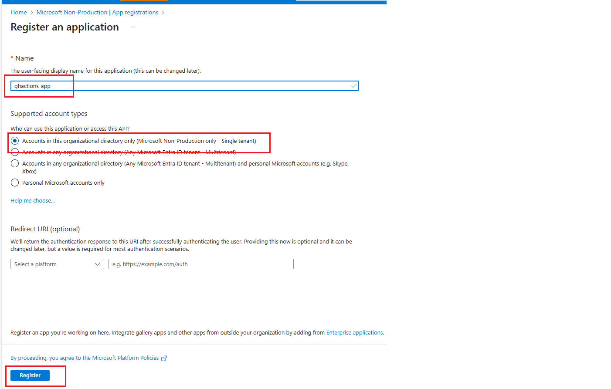
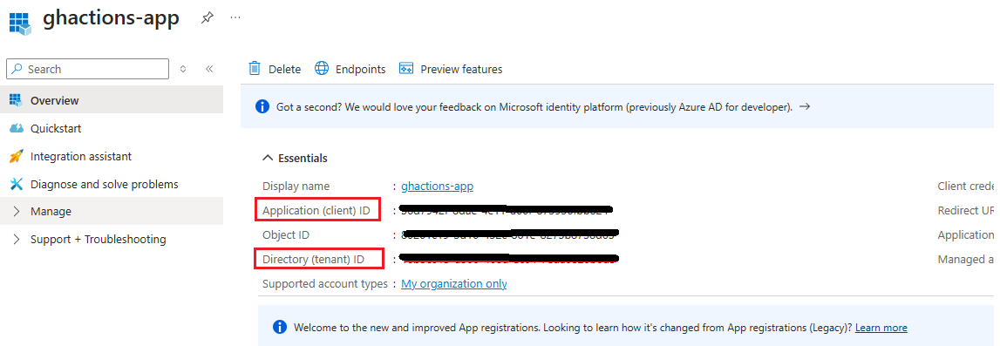
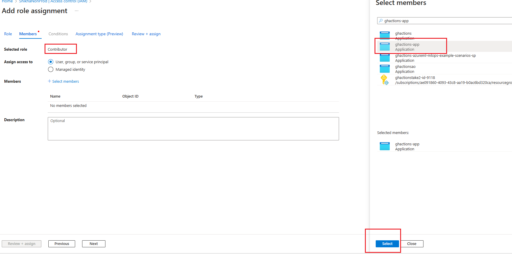
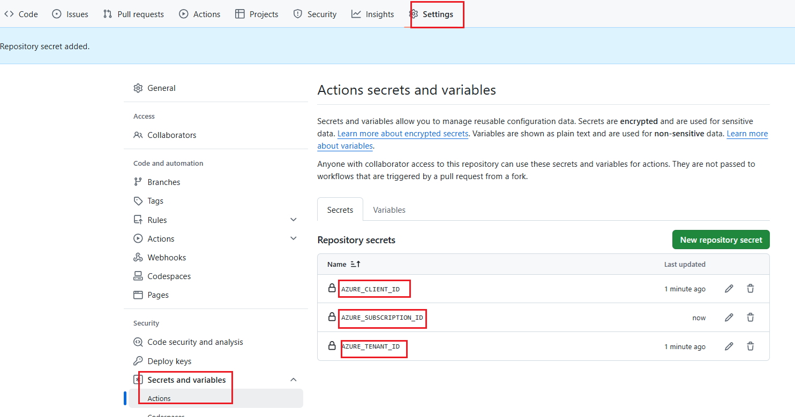
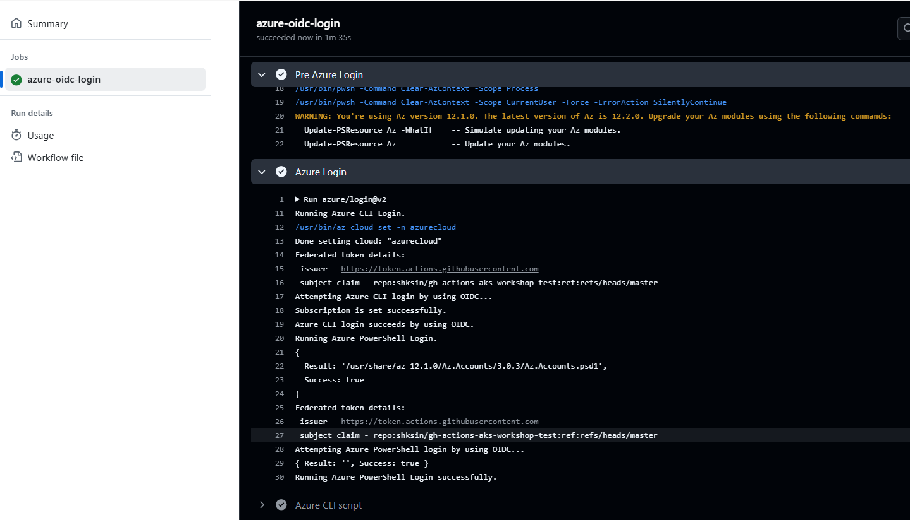

# Lab1 - Azure Login with OpenID Connect in GitHub Actions

## Objective
In this lab, you will learn how toget started with GitHub Actions by creating an Actions workflow to invoke tasks in a job. The workflow will perfoorm following tasks :

1. Login to Azure using OpenID Connect (OIDC) authentication.
2. Run some basic Azure CLI/Powershell commands to validate successful login.


## Prerequisites

To use the Azure Login action with OIDC, you need to configure a federated identity credential on a Microsoft Entra application or a user-assigned managed identity. In this lab we will look at the Microsoft Entra application approach.

### Set up a GitHub Repository for the Lab
Follow the steps below to set up a GitHub repository [___aks-github-actions-workhop___] for the lab: [Create a GitHub Repository](https://docs.github.com/en/repositories/creating-and-managing-repositories/quickstart-for-repositories).


### Microsoft Entra Application

1. **Create a Microsoft Entra Application**  
   You can create a Microsoft Entra application with a service principal using Azure Portal : 

   

2. **Obtain the Following Values:**
   - *Client ID*
   - *Subscription ID* - This is the subscription you will use to deploy your resources later
   - *Directory (tenant) ID*

   

   > **Note:** Make sure to store these values securely, as they will be used later in the GitHub Actions workflow to authenticate to Azure.

3. **Assign 'Contributor' Role to the Service Principal**  
   Use the Azure Portal, assign 'Contributor' role to your service principal.

   

4. **Configure a Federated Identity Credential**  
   Set up a federated identity credential on the Microsoft Entra application to trust tokens issued by GitHub Actions for your GitHub repository.

    

5. **Fetch values stored in Step 2 and add them as Secrets to the GitHub Repo as following: **
   - *AZURE_CLIENT_ID*
   - *AZURE_SUBSCRIPTION_ID*
   - *AZURE_TENANT_ID*


   

6. **Navigate to your GitHub Repository, select Action from the top menu and Add a workflow file:**

    

6. **Create a new workflow file and add copy the content of the yaml file in following lab to authenticate GitHub Actions workflow with Azure**

```yaml
name: Run Azure Login with OpenID Connect
on: [workflow_dispatch]

permissions:
  id-token: write # Require write permission to Fetch an OIDC token.
      
jobs: 
  azure-oidc-login:
    runs-on: ubuntu-latest
    steps:
    - name: Azure Login
      uses: azure/login@v2
      with:
        client-id: ${{ secrets.AZURE_CLIENT_ID }}
        tenant-id: ${{ secrets.AZURE_TENANT_ID }}
        subscription-id: ${{ secrets.AZURE_SUBSCRIPTION_ID }} 
        enable-AzPSSession: true
    
    - name: Azure CLI script
      uses: azure/cli@v2
      with:
        azcliversion: latest
        inlineScript: |
          az account show
          # You can write your Azure CLI inline scripts here.
          az group list -o table

    - name: Azure PowerShell script
      uses: azure/powershell@v2
      with:
        azPSVersion: latest
        inlineScript: |
          Get-AzContext  
          # You can write your Azure PowerShell inline scripts here.
          Get-AzResourceGroup
```


7. **Commit the changes to the repository and navigate to the Actions tab to see the workflow in action**

  _Select the workflow and trigger it manually_:
    


8. **Navigate to the workflow run to see the logs and verify that workflow has authenticated with Azure and has run the CLI and PowerShell scripts successfully: **

    


