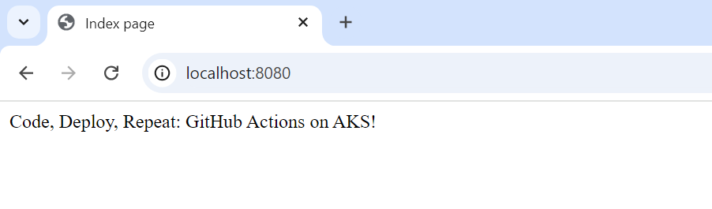
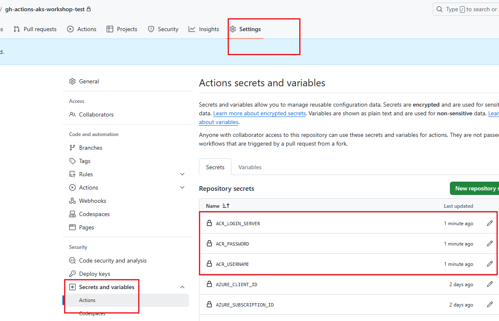
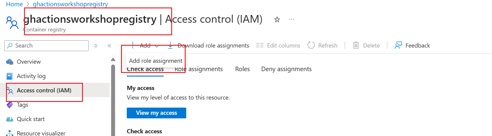
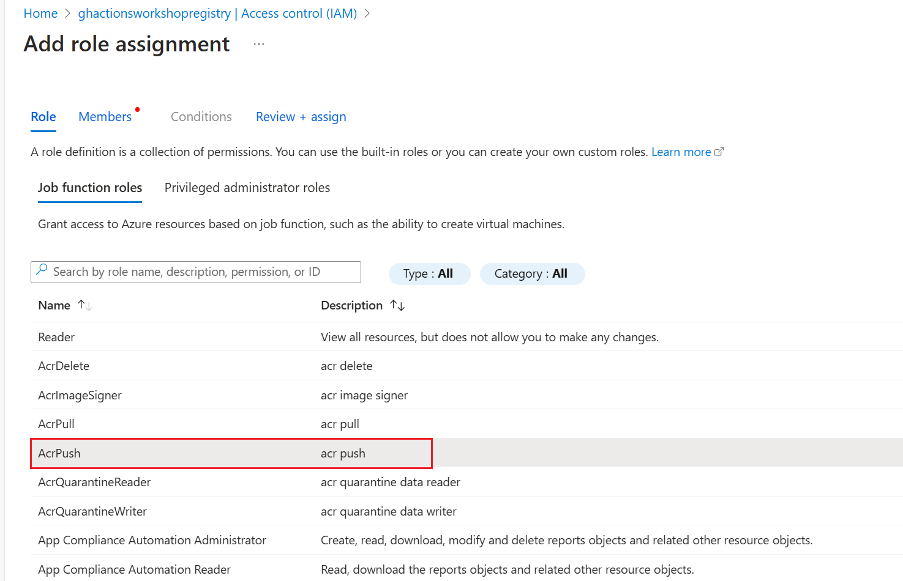

# Lab: Creating an Azure Container Registry, Pushing an Image to It, and Deploying an App to AKS Using GitHub Actions

## Objective:
This lab will guide you through the process of creating an Azure Container Registry (ACR), pushing a Docker image to it, and deploying an application to Azure Kubernetes Service (AKS) using GitHub Actions. The goal is to use native GitHub Actions as much as possible, avoiding Azure CLI-based runs.

The deployment will utilize the `@azure/k8s-deploy` GitHub Action for streamlined Kubernetes deployments.

## Prerequisites:
1. **Basic Knowledge**: Familiarity with Kubernetes, GitHub Actions, and YAML syntax. Ensure you have completed [Lab0-GitHub Actions 101](../01-gh-actions-101/readme.md) and have established successful connectivity between GitHub Actions and Azure.
1. **DockerDesktop**: Installed on your local machine. [How to install Docker Desktop](https://www.docker.com/products/docker-desktop)
1. **Azure CLI**: Installed and configured on your local machine. [How to install the Azure CLI](https://docs.microsoft.com/en-us/cli/azure/install-azure-cli)
1. **Kubectl**: Installed on your local machine. [How to install the Kubectl](https://kubernetes.io/docs/tasks/tools/)
1. **A cluster**: E.g. a deployment of [Lab2](../02-aks-101/lab2_aks_deployment_lab.md)


## Step1: Build and Test the Application Locally

 For this lab, we will use a simple Python Flask application that prints the name of the workshop.
 

### Build application
Navigate to the src folder of your repository
Build the Docker image manually by cloning the Git repo.
```
$ cd src
$ docker build -t python-flask-docker .
```


### Run the container
Create a container from the image.
```
$ docker run --name my-app -d -p 8080:8080 python-flask-docker
```
### Verify the running container
visit http://localhost:8080

[


## Step 2: Change the Trigger Type of the `deploy-nginx` workflow file created in Lab2 to `workflow_dispatch`

1. **In your repository**, navigate to the `.github/workflows` directory: 

3. **Update the trigger for ```deploy-nginx.yml``` YAML file** from `push` to `workflow_dispatch`:

```yaml
   name: Deploy Nginx to AKS

   on:
     workflow_dispatch:

  permissions:
     id-token: write # Required for OIDC authentication
     contents: read # Required to read repository contents
     '
     '
     '
```


## Step 3: Create an Azure Container Registry (ACR)

1. **Create an ACR via GitHub Actions**:
   - Add a new workflow file to your repository in the `.github/workflows` directory called `deploy-acr-aks.yml`:

     ```yaml
     name: Create Azure Container Registry

     on:
     push:
       branches:
         - main

     permissions:
        id-token: write # Require write permission to Fetch an OIDC token.
        contents: read # Required to read repository contents
        actions: read # Required for GitHub Actions
        checks: write # Required for status checks

     env:
        RESOURCE_GROUP: myResourceGroup
        AKS_CLUSTER_NAME: myAKSCluster
        ACR_NAME: myContainerRegistry

     jobs:
        create-acr:
          runs-on: ubuntu-latest

          steps:
          - name: Checkout code
            uses: actions/checkout@v2

          - name: Azure Login
            uses: azure/login@v2
            with:
              client-id: ${{ secrets.AZURE_CLIENT_ID }}
              tenant-id: ${{ secrets.AZURE_TENANT_ID }}
              subscription-id: ${{ secrets.AZURE_SUBSCRIPTION_ID }} 
      
          - name: Create Azure Container Registry
            uses: azure/cli@v2
            with:
              azcliversion: latest
              inlineScript: |
                az acr create --resource-group ${{ env.RESOURCE_GROUP }} --name ${{ env.ACR_NAME }} --sku Basic
      ```

   > **Note:** 
     - Replace `myResourceGroup` with the name of your Azure Resource Group created in Lab2.
      - Replace `myAKSCluster` with your AKS cluster created in Lab2.
      - Replace `mycontainerregistry` with the desired name for your Azure Container Registry.

2. **Run the Workflow**:
   - Commit and push the workflow file to the `main` branch. This will trigger the GitHub Actions workflow to create an ACR in your specified resource group.

3. **Verify that Azure Container Registry is created and store the credentials as GitHub Secrets**:
   - Verify that the Azure Container Registry is created in the Azure portal.
     

   - Enable Admin Login and copy container registry's login server name,  username and password.
     

   - Store the ACR_LOGIN_SERVER, ACR_USERNAME, ACR_PASSWORD as GitHub Secrets.
     

  
## Step 4: Build and Push the Docker Image to ACR Using GitHub Actions

1. **AcrPush Role Assignment**
   - Navigate to the Azure Container Registry in the Azure portal.
   - Assign the `AcrPush` role to the AppRegistration created in Lab1 on the Azure Container Registry. This will allow the GitHub Actions workflow to publish docker image to the ACR.
    !!!

2. **Update the Workflow file to Build, and Push the Image to ACR created above**:
   - Update the workflow file `.github/workflows/deploy-acr-aks.yml` and add the following step after `Create Azure Container Registry` step:


     ```yaml
     - name: Docker build and push ACR
           run: |
              az acr login --name ${{ secrets.ACR_LOGIN_SERVER }}
              docker build ./src/ --tag ${{ secrets.ACR_LOGIN_SERVER }}/myapp:v1
              docker push ${{ secrets.ACR_LOGIN_SERVER }}/myapp:v1
     ```

   
2. **Run the Workflow**:
   - Commit and push the workflow file to the `main` branch. This will trigger the GitHub Actions workflow to log in, build the Docker image, and push it to the Azure Container Registry.

3. **Verify that the docker image is published to the Azure Container Registry**:
   - Navigate to your ACR in Azure Portal and verify that the image is published.
     


## Step 4: Deploy Image from ACR to AKS Using GitHub Actions

1.**In your repository**, create a directory for Kubernetes manifests called `k8s` if it doesn't already exist.
   ```bash
   mkdir -p k8s
   ```

2. **Create a deployment YAML file for `myapp`**:
   ```bash
   touch k8s/myapp-deployment.yml
   ```

3. **Edit the deployment YAML file** with the following content:

   ```yaml
    apiVersion: apps/v1
    kind: Deployment
    metadata:
      name: myapp
      labels:
        app: myapp
    spec:
      replicas: 2
      selector:
        matchLabels:
          app: myapp
      template:
        metadata:
          labels:
            app: myapp
        spec:
          containers:
          - name: myapp
            image: <myContainerRegistry>.azurecr.io/myapp
            ports:
            - name:  http
              containerPort: 8080
              protocol: TCP
      ```

    > **Note:** 
      - Replace `myContainerRegistry` with the name of your Azure Container Registry

4. **Create a service YAML file** to expose the deployment of `myapp` as a service:
   ```bash
   touch k8s/myapp-service.yml
   ```

5. **Edit the service YAML file** with the following content:

   ```yaml
    kind: Service
    apiVersion: v1
    metadata:
      name:  myapp-svc
    spec:
      selector:
        app:  myapp
      type:  LoadBalancer
      ports:
      - name:  http
        port:  80
        targetPort: 8080
   ```

2 **Update the Workflow file to Build, and Push the Image to ACR created above**:
   - Update the workflow file `.github/workflows/deploy-acr-aks.yml` and add the following steps after `Docker build and push ACR` step:

     ```yaml
     # Set the target AKS cluster.
         - name: Set AKS context
           id: set-context
           uses: azure/aks-set-context@v3
           with:
            resource-group: '${{ env.RESOURCE_GROUP }}' 
            cluster-name: '${{ env.AKS_CLUSTER_NAME }}'
        
         - name: Create Kubernetes Secret with ACR credentials
           uses: Azure/k8s-create-secret@v3
           with:
            container-registry-url: ${{ secrets.ACR_LOGIN_SERVER }}
            container-registry-username: ${{ secrets.ACR_USERNAME }}
            container-registry-password: ${{ secrets.ACR_PASSWORD }}
            secret-name: k8s-secret

         - name: Deploy to AKS
           uses: azure/k8s-deploy@v3
           with:
            manifests: |
              k8s/myapp-deployment.yml
              k8s/myapp-deployment.yml
            images: |
              ${{ secrets.ACR_LOGIN_SERVER }}/myapp:v1
            imagepullsecrets: |
              k8s-secret
     ```

2. **Run the Workflow**:
   - Commit and push the workflow file to the `main` branch. This will trigger the GitHub Actions workflow to deploy the application to AKS.


## Step 5: Verify the Deployment

1. **Verify the Deployment**:
   - Check the status of your deployment:
     ```bash
     kubectl get deployments
     ```

   - Check the running pods:
     ```bash
     kubectl get pods
     ```

3. **Access the Application**:
   - Retrieve the external IP of the `myapp` service:
     ```bash
     kubectl get svc myapp-service
     ```
   - Open a web browser and navigate to the external IP address to see the app.

---

## Step 5: Clean Up Resources (Optional)

1. **Delete the Azure Container Registry**:
   - If you no longer need the Azure Container Registry, you can delete it using the Azure portal or CLI.

2. **Delete the AKS Cluster**:
   - If you no longer need the AKS cluster, you can delete it using the Azure portal or CLI to avoid incurring costs.

---

## Conclusion

Congratulations! You have successfully created an Azure Container Registry, pushed a Docker image to it, and deployed an application to Azure Kubernetes Service using GitHub Actions. This setup automates the entire process, from image creation to deployment, using native GitHub Actions.
